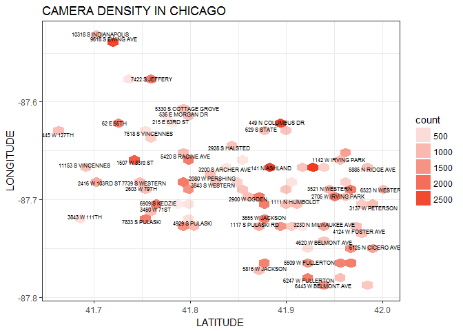
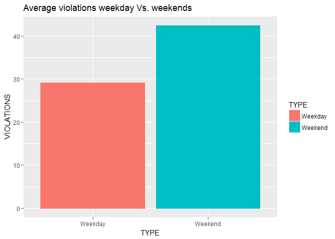
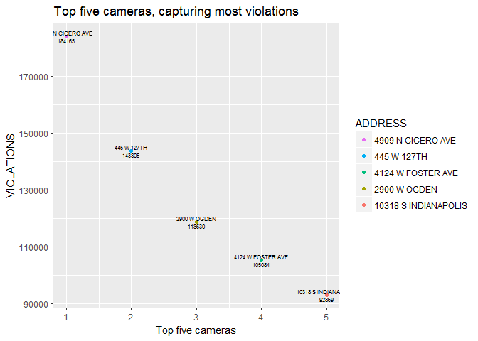
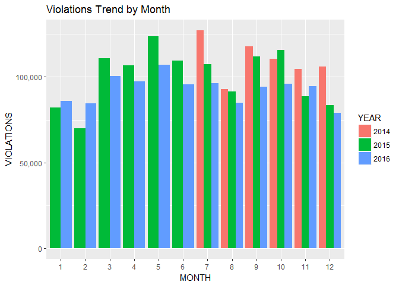
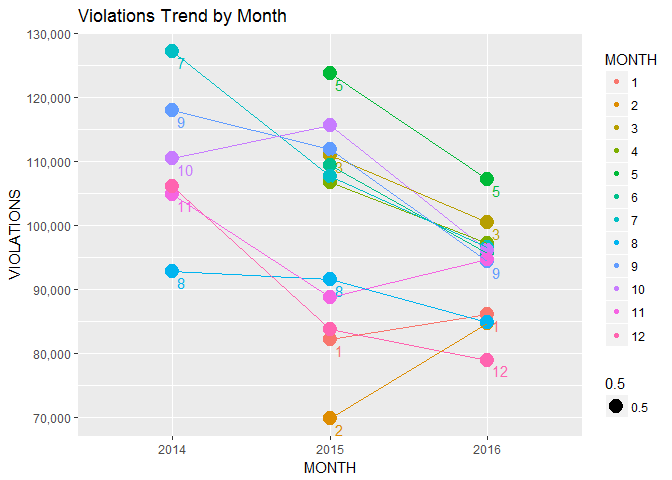

# Speed Camera Violations in Chicago, 2014-2016
Chandrasekar Ganesan  
March 9, 2017  


#Background

##Content

This dataset reflects the daily volume of speed violations that have been recorded by each camera installed in the City of Chicago as part of the Automated Speed Enforcement Program. The data reflects violations that occurred from July 1, 2014 until December 31, 2016. The reported violations were collected by the camera and radar system and reviewed by two separate city contractors. This dataset contains all violations regardless of whether a citation was issued.

##Acknowledgements

The speed camera data was collected and published by the Chicago Police Department on the City of Chicago data portal website.

##Inspiration

1) What neighborhood has the highest density of speed cameras? 
2) Do speed cameras capture more violations on weekdays or weekends? 
3) Which camera has captured the most violations? Has the number of speed violations recorded decreased over time?

# Approach

## Getting Data


```r
library(readr)
```

```
## Warning: package 'readr' was built under R version 3.3.3
```

```r
cameras <- read_csv("~/data-playground/chicagopd/cameras.csv", 
    col_types = cols(ADDRESS = col_character(), 
        `CAMERA ID` = col_character(), DATE = col_date(format = "%m/%d/%Y"), 
        LATITUDE = col_number(), LOCATION = col_character(), 
        LONGITUDE = col_number(), VIOLATIONS = col_integer()))

names(cameras) <- make.names(names(cameras))
```

## Data Cleanup 

```r
library(dplyr)
```

```
## 
## Attaching package: 'dplyr'
```

```
## The following objects are masked from 'package:stats':
## 
##     filter, lag
```

```
## The following objects are masked from 'package:base':
## 
##     intersect, setdiff, setequal, union
```

```r
tempdata <- cameras

#dataNA <- sum(is.na(tempdata$LATITUDE) & is.na(tempdata$LONGITUDE))

#Get all the unique address where LAT & LON are NA()
#Append Chicago, IL so we have a proper address.

addressNA <- tempdata[is.na(tempdata$LATITUDE) & is.na(tempdata$LONGITUDE),] %>% distinct(fulladdress=paste(ADDRESS, "Chicago, IL", sep=","))
addressNA <- cbind(addressNA, tempdata[is.na(tempdata$LATITUDE) & is.na(tempdata$LONGITUDE),] %>% distinct(ADDRESS))


#Using google's ggmap package

library(ggmap)
```

```
## Warning: package 'ggmap' was built under R version 3.3.3
```

```
## Loading required package: ggplot2
```

```r
#Find the Latitude and Longitude for the address
latlon <- lapply(addressNA[1], geocode)
```

```
## Information from URL : http://maps.googleapis.com/maps/api/geocode/json?address=1111%20N%20HUMBOLDT,Chicago,%20IL&sensor=false
```

```
## Information from URL : http://maps.googleapis.com/maps/api/geocode/json?address=7739%20S%20WESTERN,Chicago,%20IL&sensor=false
```

```
## Information from URL : http://maps.googleapis.com/maps/api/geocode/json?address=7738%20S%20WESTERN,Chicago,%20IL&sensor=false
```

```
## Information from URL : http://maps.googleapis.com/maps/api/geocode/json?address=5529%20S%20WESTERN,Chicago,%20IL&sensor=false
```

```
## Information from URL : http://maps.googleapis.com/maps/api/geocode/json?address=5520%20S%20WESTERN,Chicago,%20IL&sensor=false
```

```r
addressNA <- cbind(addressNA, latlon$fulladdress)

for(i in 1:nrow(addressNA)){
  tempdata[tempdata$ADDRESS == addressNA[i,2],]$LATITUDE <- addressNA[i,4]
  tempdata[tempdata$ADDRESS == addressNA[i,2],]$LONGITUDE <- addressNA[i,3]
  tempdata[tempdata$ADDRESS == addressNA[i,2],]$LOCATION <-  paste("(",addressNA[i,4],", ",addressNA[i,3],")", sep="" )
}
```

> Let's add few more attributes for better reporting


```r
tempdata$WEEKDAY <- as.factor(weekdays(tempdata$DATE))
tempdata$TYPE <- NA
tempdata[tempdata$WEEKDAY %in% c("Saturday","Sunday"),]$TYPE <- "Weekend"
tempdata[!(tempdata$WEEKDAY %in% c("Saturday","Sunday")),]$TYPE <- "Weekday"
tempdata$TYPE <- as.factor(tempdata$TYPE)
```

## Camera Density in Chicago

```r
#plot(tempdata$LATITUDE, tempdata$LONGITUDE, col=rgb(0,1,1,alpha=1/3), pch=20, cex=1)
library(manipulate)
library(ggplot2)

lat.min <- range(tempdata$LATITUDE)[1]
lat.max <- range(tempdata$LATITUDE)[2]
lon.min <- range(tempdata$LONGITUDE)[1]
lon.max <- range(tempdata$LONGITUDE)[2]

g <- ggplot(tempdata)
g <- g + theme_bw()
g <- g + stat_binhex(aes(x=LATITUDE, y=LONGITUDE, alpha=..count..), fill="#f03b20") 
g <- g + geom_text(size=2,check_overlap = TRUE, aes(LATITUDE, LONGITUDE, label=ADDRESS))
g + ggtitle("CAMERA DENSITY IN CHICAGO")
```

```
## Warning: package 'hexbin' was built under R version 3.3.3
```

<!-- -->

## Average violations weekday Vs. weekends


```r
violationtype <- aggregate(VIOLATIONS ~ TYPE, tempdata, mean)
p <- ggplot(violationtype)
p <- p + geom_bar(aes(TYPE, VIOLATIONS, color=TYPE,fill=TYPE), stat="identity")
p <- p + ggtitle("Average violations weekday Vs. weekends")
p
```

<!-- -->

## Camera that captured the most violations


```r
library(dplyr)
violationsbycamera <- aggregate(VIOLATIONS ~ ADDRESS, tempdata, sum)
violationsbycamera <- arrange(violationsbycamera, desc(VIOLATIONS))
# Take top 5 and plot it

top5 <- head(violationsbycamera,5)

t <- ggplot(top5)
t <- t + geom_point(aes(row(top5)[,1],VIOLATIONS, color=ADDRESS) )
t <- t + geom_text(aes(row(top5)[,1],VIOLATIONS + 0.5,label=paste(ADDRESS, VIOLATIONS, sep="\n")), size=2)
t <- t + xlab("Top five cameras")
t <- t + ggtitle("Top five cameras, capturing most violations ")
t <- t + guides(col=guide_legend(reverse = TRUE))
t
```

<!-- -->

## Violations trend over the year

Looking at the chart shown below, it is largely evident the violations are decreasing on a month to month comparison basis.


```r
tempdata$YEAR <- as.factor(as.numeric(as.character(tempdata$DATE,"%Y")))
tempdata$MONTH <- as.factor(as.numeric(as.character(tempdata$DATE,"%m")))

violationtrend <- aggregate(VIOLATIONS ~ MONTH+YEAR, tempdata, sum)
g <- ggplot(violationtrend, aes(MONTH, VIOLATIONS, fill=YEAR))
g <- g + geom_bar(stat="identity", position="dodge") 
g <- g + ggtitle("Violations Trend by Month")
g <- g + scale_y_continuous(labels = scales::comma)
g <- g + labs(x = "MONTH")
g
```

<!-- -->


```r
library(reshape2)

df2014 <- aggregate(VIOLATIONS ~ MONTH + YEAR, tempdata[tempdata$YEAR==2014,], sum)
df2015 <- aggregate(VIOLATIONS ~ MONTH + YEAR, tempdata[tempdata$YEAR==2015,], sum)
df2016 <- aggregate(VIOLATIONS ~ MONTH + YEAR, tempdata[tempdata$YEAR==2016,], sum)

mrgset1 <- merge(x = df2014, y = df2015, by = "MONTH",all=TRUE)
names(mrgset1) <- c("MONTH", "x","y","xend","yend")

mrgset2 <- merge(x = df2015, y = df2016, by = "MONTH",all=TRUE)
names(mrgset2) <- c("MONTH", "x","y","xend","yend")

g <- ggplot(violationtrend, aes(YEAR, VIOLATIONS, color=MONTH))
g <- g + geom_point(aes(cex=0.5),show.legend = TRUE) 
g <- g + geom_text(aes(YEAR, VIOLATIONS, label=paste("\n",MONTH,sep="")), size=4, show.legend = FALSE, hjust=0, nudge_x = 0.03, nudge_y = 0.01, check_overlap = TRUE)
g <- g + ggtitle("Violations Trend by Month")
g <- g + scale_y_continuous(labels = scales::comma)
g <- g + labs(x = "MONTH")
g <- g + guides(guide_legend(label=TRUE))
g <- g + geom_segment(data=mrgset1, aes(x=x,y=y,xend=xend, yend=yend), show.legend = FALSE)
g <- g + geom_segment(data=mrgset2, aes(x=x, y=y, xend=xend, yend=yend), show.legend = FALSE)
g
```

```
## Warning: Removed 6 rows containing missing values (geom_segment).
```

<!-- -->
